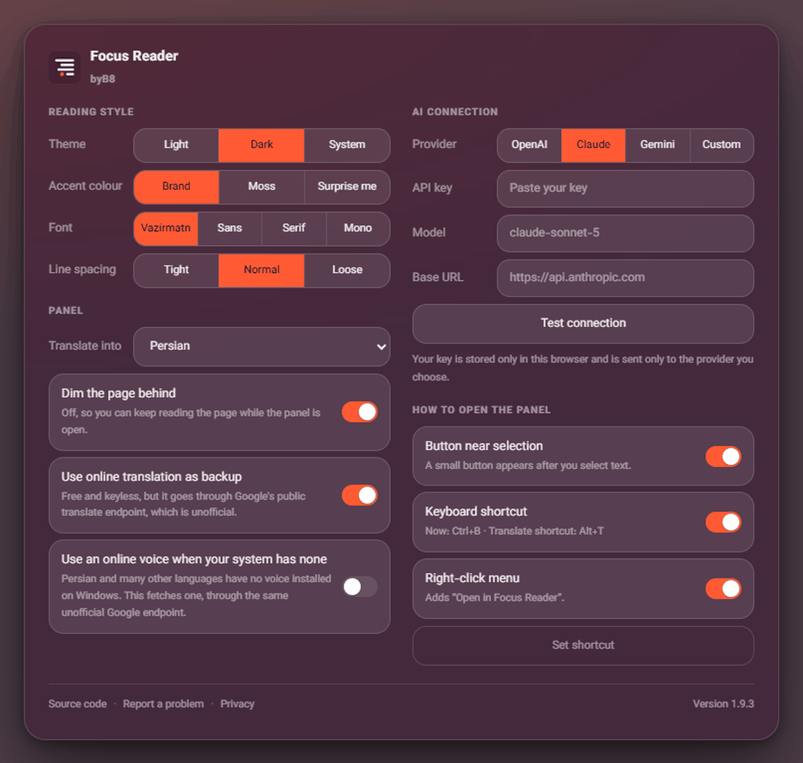

<div dir="rtl">

# Focus Reader

متن انتخاب‌شده را در یک پنجره‌ی خوانا باز می‌کند — راست‌چین و چپ‌چین، حالت شب، ویرایش، ترجمه، ابزارهای هوش مصنوعی و ذخیره‌ی متن‌ها.

یک افزونه‌ی کروم با جاوااسکریپت خالص. بدون مرحله‌ی ساخت، بدون فریم‌ورک، بدون سرور.

ساخته‌ی **B8hnam** · [by.b8hnam.com](https://by.b8hnam.com/) · [English](README.md)




https://github.com/user-attachments/assets/797e61bd-945e-49c3-a3f2-b2ff4a473d1b


**در ویدیو:** سه روش باز کردن پنل · چند پنجره و جاگاه · ترجمه در جای متن · ابزارهای هوش مصنوعی با کلید خودتان · متن‌های ذخیره‌شده · پنل کناری · سبک خواندن

---

## درباره‌ی این پروژه

Focus Reader یک ابزار شخصی است — برای استفاده‌ی خودِ نویسنده ساخته شده، و منتشر شده چون شاید به کار دیگران هم بیاید. نقشه‌ی راه عمومی و تعهد پشتیبانی وجود ندارد. به‌روزرسانی‌ها وقتی می‌آیند که چیزی در استفاده‌ی روزمره نیاز به رفع داشته باشد، یا ایده‌ای ارزش ساختن داشته باشد، یا فقط وقتش برسد — نه طبق برنامه‌ی زمانی مشخص.

در عمل یعنی:

- گزارش مشکل و درخواست ادغام خوانده می‌شوند، ولی هیچ زمان پاسخ‌گویی و هیچ تضمینی برای اقدام روی آن‌ها نیست.
- نسخه‌ی تازه هروقت آماده شود منتشر می‌شود، بدون تقویم مشخص پشتش.
- اگر تغییری در کروم افزونه را از کار بیندازد، هروقت وقتش برسد رفع می‌شود.

اگر به چیزی قابل‌پیش‌بینی‌تر نیاز دارید — رفع تضمینی، نقشه‌ی راه، بررسی فعال مشارکت‌ها — کد دقیقاً برای همین زیر پروانه‌ی GPL منتشر شده تا بتوانید انشعاب بگیرید و به روش خودتان اجرایش کنید.

---

## نصب

### از روی کد (بارگذاری پوشه)

۱. کد را دریافت کنید، یا پرونده‌ی فشرده‌ی [آخرین نسخه](../../releases/latest) را بگیرید.
۲. جایی از حالت فشرده خارجش کنید که پاک یا جابه‌جا نشود، مثلاً `C:\Users\<نام کاربری>\ChromeExtensions\focus-reader`. کروم هر بار از همان مسیر می‌خواند؛ اگر پوشه جابه‌جا شود افزونه از کار می‌افتد.
۳. به نشانی `chrome://extensions` بروید.
۴. کلید **Developer mode** را روشن کنید.
۵. روی **Load unpacked** بزنید و پوشه‌ای را انتخاب کنید که `manifest.json` داخلش است (اگر مخزن را کپی کرده‌اید یعنی پوشه‌ی `src`، و اگر پرونده‌ی نسخه را گرفته‌اید یعنی همان پوشه‌ی باز شده).
۶. آیکن را روی نوار ابزار سنجاق کنید.

کروم ۱۱۶ به بالا لازم است. از کروم ۱۳۸ به بعد موتور ترجمه‌ی درون‌دستگاهی هم فعال می‌شود.

### از فروشگاه افزونه‌های کروم

فعلاً آنجا منتشر نشده است. اگر منتشر شود، پیوندش همین‌جا می‌آید.

---

## سه راه باز کردن پنجره

هر سه در تنظیمات افزونه جداگانه خاموش و روشن می‌شوند:

| راه | رفتار |
| --- | --- |
| دکمه کنار متن | بعد از انتخاب متن، دکمه‌ی کوچکی زیر آن ظاهر می‌شود. |
| کلید میانبر | `Ctrl + B` خواننده را باز می‌کند و `Alt + T` آن را از همان اول ترجمه‌شده باز می‌کند. اگر افزونه‌ی دیگری کلیدی را گرفته باشد کروم بی‌صدا کنارش می‌گذارد، برای همین در تنظیمات کلیدی که کروم واقعاً تخصیص داده نشان داده می‌شود و از همان‌جا قابل تغییر است. وقتی پنجره‌ای در حالت ویرایش باشد، `Ctrl + B` دوباره معنی «پررنگ» می‌دهد. |
| منوی کلیک راست | گزینه‌ی «باز کردن در Focus Reader» به منوی انتخاب متن اضافه می‌شود. |

## داخل پنجره

**پنجره‌ها، جمع.** هر بار که خواننده را باز کنید یک پنجره‌ی تازه می‌گیرید — تا هشت تا هم‌زمان. کوچک کردن، تمام‌صفحه، بستن، جابه‌جایی با نوار عنوان، تغییر اندازه با کشیدن هر گوشه یا لبه، دوبار کلیک روی نوار عنوان برای تمام‌صفحه، و `Esc` برای بستن پنجره‌ی جلویی. همه‌ی تغییر حالت‌ها با منحنی فنری به سبک آی‌اواس متحرک‌سازی شده‌اند.

**جایگاه پنجره‌های کوچک‌شده.** پنجره‌های کوچک‌شده در یک گوشه روی هم جمع می‌شوند، مثل نوار وظیفه‌ی ویندوز. هرکدام را بکشید، کل دسته با آن جابه‌جا می‌شود. با دکمه‌ی بازگردانی (یا دوبار کلیک) پنجره با همان اندازه و جای قبلی برمی‌گردد.

**صفحه خوانا می‌ماند.** پنجره روی صفحه شناور است بدون اینکه پشتش را تار یا تیره کند، پس هم‌زمان هم می‌شود صفحه را خواند و هم داخل سایت کلیک کرد. اگر تیره شدن صفحه را ترجیح می‌دهید، در تنظیمات کلیدش هست.

**قالب‌بندی حفظ می‌شود.** تیترها، پررنگ، ایتالیک، فهرست‌ها، نقل‌قول‌ها، پیوندها، جدول‌ها و بلوک‌های کد از صفحه منتقل می‌شوند. نشانه‌گذاری از روی یک فهرست مجاز سخت‌گیرانه بازسازی می‌شود — اسکریپت، استایل، تصویر، آی‌فریم و همه‌ی ویژگی‌ها به‌جز مقصد پیوندها حذف می‌شوند — پس هیچ‌چیزی از صفحه‌ی مبدأ نمی‌تواند روی پنجره استایل یا کد اجرا کند.

**ابزارها.** کپی · ذخیره (به‌همراه عنوان، نشانی و تاریخ صفحه) · دریافت به‌صورت پرونده‌ی متنی · خواندن با صدای بلند · پاکسازی متن فارسی (ی و ک عربی، کشیده، اعراب، نویسه‌های نامرئی، رقم‌های عربی، واژه‌های شکسته با خط تیره) · جهت متن · اندازه‌ی متن · حالت شب و روز · ویرایش (پیش‌فرض خاموش) · متن‌های ذخیره‌شده.

**ترجمه.** سه موتور، به‌ترتیب امتحان می‌شوند و قالب‌بندی در همه‌شان حفظ می‌ماند، چون هر گره‌ی متنی سر جای خودش ترجمه می‌شود:

۱. **موتور درون‌دستگاهی کروم** (کروم ۱۳۸ به بالا) — رایگان، خصوصی، و پس از دریافت اولیه‌ی بسته‌ی زبان بدون نیاز به اینترنت. فهرست زبان‌های کروم محدود است و به فضای کافی برای مدل‌ها نیاز دارد، پس همیشه در دسترس نیست.
۲. **ترجمه‌ی برخط** — رایگان و بدون کلید، از راه نقطه‌ی پایانی عمومی ترجمه‌ی گوگل. آن نقطه‌ی پایانی رابط برنامه‌نویسی مستند‌شده‌ای **نیست**: هر لحظه ممکن است تغییر کند یا از کار بیفتد. کلیدش در تنظیمات هست.
۳. **کلید هوش مصنوعی خودتان**، اگر تنظیمش کرده باشید.

پس از اینکه متنی یک بار ترجمه شد، جابه‌جایی بین متن اصلی و هر ترجمه‌ای که قبلاً ساخته‌اید آنی است و هیچ درخواستی نمی‌فرستد.

**ابزارهای هوش مصنوعی.** کلید خودتان را در تنظیمات وصل کنید (OpenAI، Anthropic، Google یا هر نقطه‌ی پایانی سازگار با OpenAI) و دکمه‌ی درخشش این‌ها را می‌دهد: خلاصه، نکته‌های کلیدی، ترجمه به فارسی، ترجمه به انگلیسی، توضیح ساده، اصلاح نگارش، و یک جعبه‌ی پرسش آزاد. درخواست‌ها از کارگر پس‌زمینه‌ی خود افزونه مستقیم به همان سرویسی می‌روند که انتخاب کرده‌اید. هیچ سروری وسط نیست، چون اصلاً سروری وجود ندارد.

**سنجاق و پنل کناری.** پنجره را سنجاق کنید تا در همان زبانه به صفحه‌ی بعدی هم بیاید، یا آن را به پنل کناری کروم بفرستید تا هرجا بروید سر جایش بماند.

**خواندن کل صفحه.** دکمه‌ی «خواندن این صفحه» متن اصلی مقاله را از صفحه بیرون می‌کشد و بدون تبلیغ و ستون کناری در پنجره باز می‌کند.

---

## کارایی

اسکریپت محتوا تا وقتی از آن استفاده نکنید عمداً بی‌کار است. هنگام بارگذاری صفحه فقط چهار شنونده‌ی غیرفعال (passive) وصل می‌کند و هیچ کار دیگری نمی‌کند: نه عنصری ساخته می‌شود، نه تنظیماتی از حافظه خوانده می‌شود، نه قلمی دریافت می‌شود، نه زمان‌سنجی اجرا می‌شود. نشانه‌گذاری پنجره، شیوه‌نامه و قلم در نخستین انتخاب متن ساخته و بعد از آن بازاستفاده می‌شوند. قاب‌های کوچک‌تر از ۲۶۰×۲۰۰ (جای تبلیغ و نویسه‌های ردیابی) کلاً کنار گذاشته می‌شوند، و شنونده‌ی پیمایش فقط تا وقتی دکمه‌ی انتخاب روی صفحه است ثبت می‌شود — آن هم غیرفعال، تا هرگز نتواند پیمایش را کند کند.

## حریم خصوصی

بدون سرور، بدون آمارگیری، بدون ردیابی، بدون حساب کاربری. تنها درخواست‌های شبکه‌ای، ترجمه و همان تماس‌های هوش مصنوعی است که خودتان تنظیم و اجرا می‌کنید. جزئیات کامل در [PRIVACY.md](PRIVACY.md).

## زبان

رابط از زبان کروم پیروی می‌کند؛ انگلیسی و فارسی در `src/_locales/` همراه افزونه هستند. جهت متن داخل پنجره برای هر متن جداگانه تشخیص داده می‌شود، پس گشت‌وگذار فارسی و انگلیسی هم‌زمان بدون هیچ تنظیمی کار می‌کند.

---

## ساختار مخزن

<div dir="ltr">

```
src/                  خود افزونه — همین پوشه است که کروم بارگذاری می‌کند
  manifest.json       مانیفست نسخه‌ی سه
  background.js       کارگر پس‌زمینه: منوها، میانبرها، درخواست‌های ترجمه و هوش مصنوعی
  content.js          پنجره، ابزارها و هرچه روی صفحه دیده می‌شود
  palette.js          ساخت رنگ تأکیدی
  popup.*             صفحه‌ی تنظیمات
  sidepanel.*         نمای پنل کناری کروم
  _locales/           en، fa
  fonts/              وزیرمتن (OFL 1.1)
  icons/              ۱۶ / ۳۲ / ۴۸ / ۱۲۸
docs/store-listing.md متن فروشگاه افزونه‌های کروم
PRIVACY.md            سیاست حریم خصوصی
CHANGELOG.md          تاریخچه‌ی تغییرات
TRADEMARK.md          چیزهایی که پروانه شاملشان نمی‌شود
```

</div>

مرحله‌ی ساخت وجود ندارد. پرونده‌ای را در `src` تغییر دهید، افزونه را در `chrome://extensions` بازخوانی کنید، تمام.

## انتشار نسخه‌ها

با فرستادن برچسبی مثل `v1.9.0` جریان [`.github/workflows/release.yml`](.github/workflows/release.yml) اجرا می‌شود: بررسی می‌کند برچسب با مقدار `version` در `src/manifest.json` یکی باشد، **محتوای** پوشه‌ی `src` را فشرده می‌کند (کروم لازم دارد `manifest.json` در ریشه‌ی پرونده‌ی فشرده باشد) و آن را به‌عنوان پیوست نسخه در گیت‌هاب منتشر می‌کند. مراحل دقیقش در [CONTRIBUTING.md](CONTRIBUTING.md) آمده است.

## مشارکت

اول هشدار وضعیت پروژه را در بالا بخوانید، بعد [CONTRIBUTING.md](CONTRIBUTING.md).

---

## پروانه

[پروانه‌ی عمومی همگانی گنو، نسخه‌ی ۳ یا بالاتر](LICENSE) — با یک شرط افزوده بر پایه‌ی بند ۷(e) همان پروانه: **نام «Focus Reader»، نام‌های byB8 و B8hnam، و لوگو و پرونده‌های آیکن مشمول پروانه نیستند.** اگر انشعاب می‌گیرید، کد را بردارید و نام و آیکن‌ها را عوض کنید. توضیح در [TRADEMARK.md](TRADEMARK.md).

حق نشر © ۲۰۲۶ بهنام عظیمی (B8hnam).

قلم وزیرمتن از صابر رستی‌کردار، با پروانه‌ی SIL Open Font License 1.1 — در `src/fonts/VAZIRMATN-OFL.txt`. بدون تغییر همراه افزونه است و زیر پروانه‌ی خودش می‌ماند، نه GPL.

</div>
